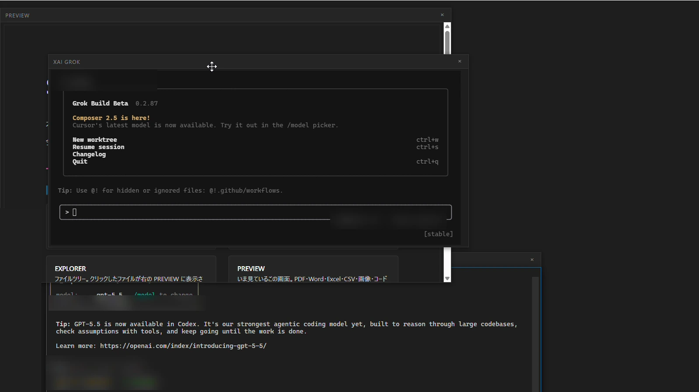

# ShadowHarness

**AIエージェントに、ひとつの机と記憶を。**

**One desk and one memory for every AI agent.**

ShadowHarnessは、GPT / Codex、Claude Code、Grok、Geminiなどを一つの画面で使うための、
Windows向け統合LLMターミナル／エージェントデスクトップです。Explorer、Preview、Editor、
複数のAIペインに加え、必要な過去だけを次の作業へ返すSidera Memoryを一つの作業環境にまとめます。

ShadowHarness is an integrated LLM terminal and agent desktop for Windows. It brings GPT / Codex,
Claude Code, Grok, Gemini, and more into one workspace with files, previews, editing, and Sidera
Memory—the layer that returns only the past that matters to the current task.



- **サイト / Website**: https://shadowharness.github.io/ （[English](https://shadowharness.github.io/en/)）
- **ガイド / Guide**: https://shadowharness.github.io/guide/ （[English](https://shadowharness.github.io/en/guide/)）
- **X**: [@ShadowHarness](https://x.com/ShadowHarness)
- **YouTube**: [@ShadowHarness](https://www.youtube.com/@ShadowHarness)

---

このリポジトリは公式サイトのソースです。This repository holds the source of the official website.

```sh
npm ci
npm run dev     # ローカルプレビュー / local preview
npm run build   # 静的ビルド / static build
```
